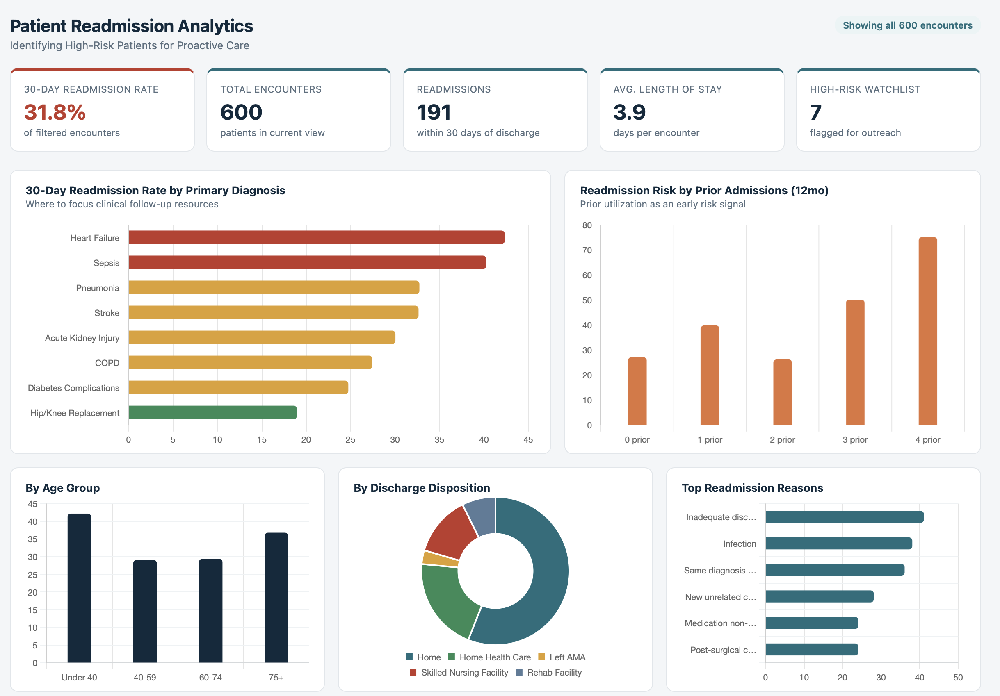

# 🏥 Patient Readmission Analytics

## 📌 Project Overview

This project analyzes hospital patient data to identify patients at high risk of 30-day readmission. The objective is to help healthcare providers improve patient outcomes through data-driven decision-making.

---

## 📊 Dashboard Preview

## 🎯 Business Problem

Hospital readmissions increase healthcare costs and reduce operational efficiency. This project identifies high-risk patients using healthcare data and presents actionable insights through SQL analysis and an interactive dashboard.

---

## 🛠️ Tools Used

- SQL
- Microsoft Excel
- Business Requirements Document (BRD)
- Power BI Dashboard

---

## 📂 Project Files

- Patient Dataset
- SQL Analysis
- Excel Analysis
- Business Requirements Document
- Interactive Dashboard

---

## 📊 Key Insights

- Identified patients with high readmission risk
- Analyzed encounter and diagnosis trends
- Built a dashboard for monitoring readmission metrics

---

## 🚀 Skills Demonstrated

- Business Analysis
- SQL
- Data Analysis
- Dashboard Development
- Data Visualization
- Healthcare Analytics
- Requirements Gathering

---

## 👨‍💻 Author

**Shivam Chaudhary**

Business Analyst | Healthcare Analytics
